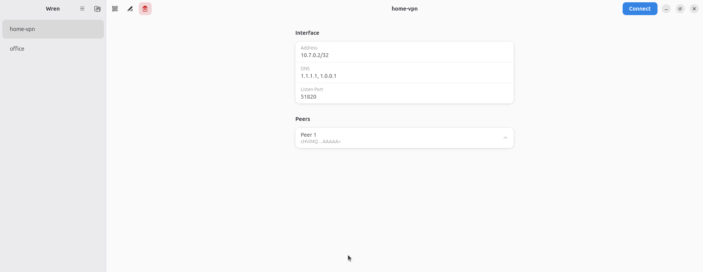

<p align="center">
  
</p>

<h1 align="center">Wren</h1>

<p align="center">
  Нативный клиент WireGuard для рабочего стола GNOME — импортируй,
  подключай и управляй туннелями из чистого окна GTK4, без терминала.
</p>

<p align="center">
  🇬🇧 English version — <a href="./README.md">README.md</a>
</p>

<p align="center">
  <a href="https://github.com/j0ck4/wren/actions/workflows/ci.yml"></a>
  <a href="https://www.gnu.org/licenses/gpl-3.0"></a>
  <a href="https://www.rust-lang.org/"></a>
</p>

<p align="center">
  
</p>

## О приложении

Wren управляет VPN-туннелями WireGuard в Linux через нативный интерфейс
на GTK4 / libadwaita. Это надстройка над стандартными инструментами
`wg-quick`: импортируешь обычный файл `.conf`, который выдаёт твой
VPN-провайдер или админ, а затем поднимаешь/опускаешь туннель, смотришь
статус и правишь его — без терминала.

## Возможности

- **Подключение / отключение одной кнопкой** через `wg-quick` с
  авторизацией polkit (пароль кэшируется на несколько минут, а не
  спрашивается каждый раз).
- **Импорт любого стандартного `.conf`** через диалог выбора файла — без
  ручного редактирования.
- **Статистика трафика в реальном времени** (принято / отправлено) с
  обновлением раз в две секунды, пока туннель поднят.
- **Полный просмотр деталей** — адрес, DNS, порт, MTU и каждый peer со
  своими allowed IPs, endpoint и keepalive.
- **Встроенный редактор** — правка полей интерфейса, добавление и
  удаление пиров прямо из UI.
- **Безопасное удаление туннелей** — диалог подтверждения сначала
  отключает активный туннель.
- **Поделиться на телефон через QR-код** — сканируется прямо в
  приложение WireGuard на Android или iOS.
- **Системный трей** (StatusNotifierItem) с переключателем по каждому
  туннелю и уведомлениями при подключении / отключении.
- **Автозапуск при входе** одним переключателем.
- **Нативность везде** — GTK4 / libadwaita, Wayland и X11, по гайдлайнам
  GNOME (HIG).

## Состояние

Раннее развитие. Спецификация — в [`wren-project.ru.md`](./wren-project.ru.md).

## Документация

Для **обычных пользователей** (скачал → установил → пользуется):
- [USAGE.md](./USAGE.md) — End-user guide (English)
- [USAGE.ru.md](./USAGE.ru.md) — Руководство пользователя (рус.)

Для **разработчиков и продвинутых юзеров** (native install, сборка из
исходников, polkit, file layout):
- [DEVELOPING.md](./DEVELOPING.md) — Developer guide (English)
- [DEVELOPING.ru.md](./DEVELOPING.ru.md) — Гайд для разработчиков (рус.)

Ниже — быстрая инструкция для сборки.

## Установка готового bundle

Для пользователей, которые хотят попробовать без сборки.

```bash
# 1. Установить Flathub (если ещё не сделано)
flatpak remote-add --if-not-exists --user flathub \
    https://dl.flathub.org/repo/flathub.flatpakrepo

# 2. Скачать wren-vX.Y.Z.flatpak с GitHub Releases:
#    https://github.com/j0ck4/wren/releases

# 3. Установить
flatpak install --user wren-vX.Y.Z.flatpak

# 4. Запустить
flatpak run io.github.j0ck4.Wren.Devel
```

Bundle самодостаточен и работает на любом дистрибутиве с Flatpak (Ubuntu,
Fedora, Arch, openSUSE…). Зависимости (GNOME 50 runtime, ~600 МБ)
подтянутся автоматически с Flathub при первой установке.

Дополнительно нужны **WireGuard tools** на хосте — Wren вызывает
`wg-quick`:

```bash
sudo apt install wireguard-tools     # Debian / Ubuntu
```

## Сборка из исходников

### Через Flatpak (рекомендуется)

```bash
# Один раз: добавить flathub и установить GNOME SDK 50
flatpak remote-add --if-not-exists --user flathub https://dl.flathub.org/repo/flathub.flatpakrepo
flatpak install --user flathub org.gnome.Sdk//50 org.gnome.Platform//50 \
  org.freedesktop.Sdk.Extension.rust-stable//25.08 \
  org.freedesktop.Sdk.Extension.llvm20//25.08

# Сборка и запуск
flatpak-builder --user --install --force-clean build-dir \
  build-aux/flatpak/io.github.j0ck4.Wren.Devel.json
flatpak run io.github.j0ck4.Wren.Devel
```

### Локальная сборка (нужны системные dev-пакеты)

```bash
sudo apt install meson ninja-build pkg-config \
    libgtk-4-dev libadwaita-1-dev libglib2.0-dev libdbus-1-dev cargo
meson setup builddir --buildtype=release
meson compile -C builddir
sudo meson install -C builddir
```

> Нужен Rust 1.85+ (edition 2024). Если `cargo` в дистрибутиве старее —
> поставь [rustup](https://rustup.rs) или используй сборку через Flatpak
> выше. Подробности и инструкции по **удалению** обоих вариантов — в
> [DEVELOPING.md](./DEVELOPING.md).

## Лицензия

GPL-3.0-or-later — см. [LICENSE](./LICENSE).
